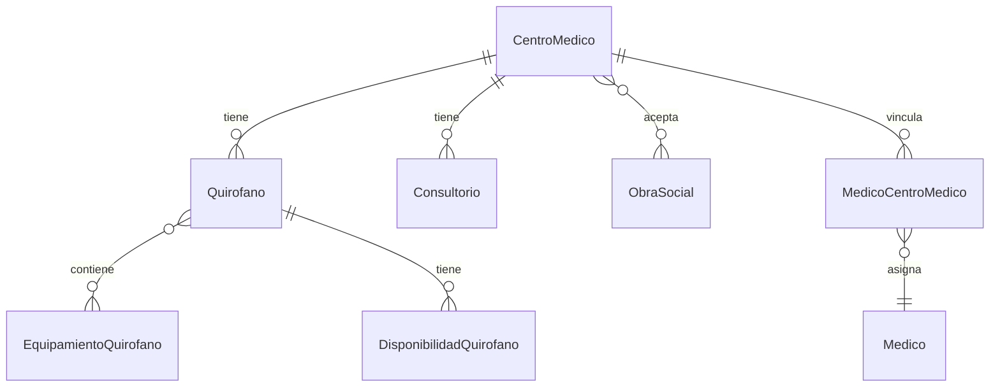

# App Centros Médicos

## Descripción
Gestiona la información de centros médicos, quirófanos, consultorios y sus relaciones con médicos y obras sociales.

## Modelos

### CentroMedico
- **Campos principales:**
  - `nombre`: Nombre del centro
  - `direccion`: Dirección física
  - `telefono`: Número de contacto
  - `email`: Correo electrónico
  - `obras_sociales`: ManyToMany → ObraSocial
  - `activo`: Estado del centro

### Quirofano
- **Campos principales:**
  - `centro_medico`: ForeignKey → CentroMedico
  - `nombre`: Identificador del quirófano
  - `tipo`: Tipo de quirófano
  - `capacidad`: Capacidad máxima
  - `equipamiento_fijo`: ManyToMany → EquipamientoQuirofano
  - `estado`: Estado actual

### Consultorio
- **Campos principales:**
  - `centro_medico`: ForeignKey → CentroMedico
  - `numero`: Número de consultorio
  - `tipo`: Tipo de consultorio
  - `equipamiento`: Descripción del equipamiento
  - `estado`: Estado actual

### MedicoCentroMedico
- **Campos principales:**
  - `medico`: ForeignKey → Medico
  - `centro_medico`: ForeignKey → CentroMedico
  - `horarios`: ManyToMany → HorarioAtencion
  - `activo`: Estado de la relación
  - `fecha_inicio`: Fecha de inicio
  - `fecha_fin`: Fecha de finalización

## Diagrama de Relaciones


## Validadores
```python
def validar_horario_disponible(quirofano, fecha, hora_inicio, hora_fin):
    """Valida disponibilidad de quirófano en horario específico"""
    if DisponibilidadQuirofano.objects.filter(
        quirofano=quirofano,
        fecha=fecha,
        hora_inicio__lt=hora_fin,
        hora_fin__gt=hora_inicio
    ).exists():
        raise ValidationError("El quirófano no está disponible en ese horario")

def validar_equipamiento_requerido(quirofano, tipo_cirugia):
    """Verifica que el quirófano tenga el equipamiento necesario"""
    equipamiento_requerido = tipo_cirugia.equipamiento_requerido.all()
    equipamiento_disponible = quirofano.equipamiento_fijo.all()
    
    faltantes = equipamiento_requerido.exclude(
        id__in=equipamiento_disponible.values_list('id', flat=True)
    )
    
    if faltantes.exists():
        raise ValidationError(f"Falta equipamiento requerido: {', '.join(faltantes)}")
```

## Métodos del Modelo
```python
def verificar_disponibilidad(self, fecha, hora_inicio, hora_fin):
    """Verifica disponibilidad de quirófano"""
    return not self.disponibilidad_set.filter(
        fecha=fecha,
        hora_inicio__lt=hora_fin,
        hora_fin__gt=hora_inicio
    ).exists()

def asignar_equipamiento_temporal(self, equipamiento, fecha_inicio, fecha_fin):
    """Asigna equipamiento temporal al quirófano"""
    return EquipamientoAlquilado.objects.create(
        quirofano=self,
        equipamiento=equipamiento,
        fecha_inicio=fecha_inicio,
        fecha_fin=fecha_fin
    )
```

## Vistas Principales
- `lista_centros/`: Lista de centros médicos
- `detalle_centro/`: Información detallada
- `quirofanos/`: Gestión de quirófanos
- `consultorios/`: Gestión de consultorios
- `disponibilidad/`: Calendario de disponibilidad

## Permisos
1. **Gestión de centros:**
   - Administradores del sistema
   - Directores médicos

2. **Gestión de quirófanos:**
   - Jefes de quirófano
   - Coordinadores quirúrgicos

3. **Asignación de consultorios:**
   - Administrativos autorizados
   - Coordinadores médicos

## Signals
- Notificar cambios de estado de quirófanos
- Actualizar disponibilidad al programar cirugías
- Registrar cambios en equipamiento

## Tests
```python
class QuirofanoTests(TestCase):
    def setUp(self):
        self.centro = CentroMedico.objects.create(
            nombre="Centro Test",
            direccion="Dirección Test"
        )
        self.quirofano = Quirofano.objects.create(
            centro_medico=self.centro,
            nombre="Quirófano 1"
        )

    def test_disponibilidad(self):
        fecha = date.today()
        self.assertTrue(
            self.quirofano.verificar_disponibilidad(
                fecha,
                time(9, 0),
                time(11, 0)
            )
        )
```

## Consideraciones de Seguridad
1. **Acceso:**
   - Control por rol y centro
   - Registro de actividades
   - Trazabilidad de cambios

2. **Validaciones:**
   - Verificación de credenciales
   - Control de horarios
   - Restricciones por tipo

## Reportes
1. **Operativos:**
   - Ocupación de quirófanos
   - Uso de consultorios
   - Estadísticas por centro

2. **Administrativos:**
   - Convenios activos
   - Médicos por centro
   - Equipamiento disponible

## Integración con Otras Apps
- Operaciones (programación quirúrgica)
- Turnos (gestión de consultorios)
- Obras Sociales (convenios)
- Médicos (asignaciones)

## Mantenimiento
- Actualización de equipamiento
- Verificación de disponibilidad
- Control de convenios
- Backup de registros 