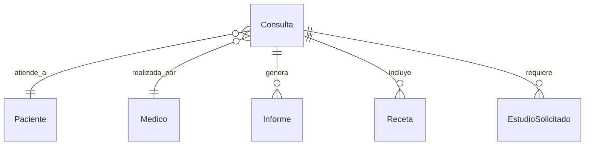

# App Consultas

## Descripción
Gestiona las consultas médicas, incluyendo agendamiento, registro de atención, diagnósticos y seguimiento de pacientes.

## Modelos

### Consulta
- **Campos principales:**
  - `paciente`: ForeignKey → Paciente
  - `medico`: ForeignKey → Medico
  - `fecha_hora`: Fecha y hora de la consulta
  - `tipo_consulta`: Tipo (PRIMERA_VEZ, SEGUIMIENTO, URGENCIA)
  - `motivo`: Motivo de la consulta
  - `sintomas`: Descripción de síntomas
  - `diagnostico`: Diagnóstico médico
  - `tratamiento`: Tratamiento indicado
  - `estado`: Estado de la consulta
  - `notas`: Notas adicionales
  - `duracion`: Duración en minutos

## Diagrama de Relaciones


## Estados y Transiciones
```python
ESTADOS_CONSULTA = [
    ('PROGRAMADA', 'Programada'),
    ('CONFIRMADA', 'Confirmada'),
    ('EN_CURSO', 'En curso'),
    ('FINALIZADA', 'Finalizada'),
    ('CANCELADA', 'Cancelada'),
    ('AUSENTE', 'Paciente Ausente'),
]

def puede_transicionar(self, nuevo_estado):
    transiciones_validas = {
        'PROGRAMADA': ['CONFIRMADA', 'CANCELADA'],
        'CONFIRMADA': ['EN_CURSO', 'AUSENTE', 'CANCELADA'],
        'EN_CURSO': ['FINALIZADA'],
        'FINALIZADA': [],
        'CANCELADA': [],
        'AUSENTE': []
    }
    return nuevo_estado in transiciones_validas[self.estado]
```

## Validadores
```python
def validar_horario_consulta(value):
    """Valida que la consulta esté dentro del horario laboral"""
    hora = value.time()
    if hora < time(8, 0) or hora > time(20, 0):
        raise ValidationError(
            "Las consultas deben programarse entre las 8:00 y las 20:00"
        )

def validar_disponibilidad_medico(medico, fecha_hora, duracion):
    """Verifica disponibilidad del médico"""
    hora_fin = fecha_hora + timedelta(minutes=duracion)
    if Consulta.objects.filter(
        medico=medico,
        fecha_hora__lt=hora_fin,
        fecha_hora__gt=fecha_hora
    ).exists():
        raise ValidationError("El médico no está disponible en ese horario")
```

## Métodos del Modelo
```python
def confirmar_asistencia(self):
    """Confirma la asistencia del paciente"""
    if self.estado == 'PROGRAMADA':
        self.estado = 'CONFIRMADA'
        self.save()
        self.notificar_confirmacion()
        return True
    return False

def registrar_atencion(self, diagnostico, tratamiento):
    """Registra la atención realizada"""
    self.diagnostico = diagnostico
    self.tratamiento = tratamiento
    self.estado = 'FINALIZADA'
    self.fecha_atencion = timezone.now()
    self.save()
    self.generar_informe()
```

## Vistas Principales
- `agendar_consulta/`: Agendamiento de consultas
- `sala_espera/`: Vista de sala de espera
- `atencion_consulta/`: Registro de atención
- `historial_consultas/`: Historial por paciente

## Permisos
1. **Agendar consultas:**
   - Médicos
   - Administrativos
   - Pacientes (portal web)

2. **Registrar atención:**
   - Médicos asignados
   - Supervisores médicos

3. **Ver historial:**
   - Médicos tratantes
   - Paciente (solo propias)

## Signals
- Notificar confirmación al paciente
- Actualizar estado en sala de espera
- Registrar cambios en historia clínica

## Tests
```python
class ConsultaTests(TestCase):
    def setUp(self):
        self.paciente = Paciente.objects.create(
            nombre="Juan",
            apellido="Pérez"
        )
        self.medico = Medico.objects.create(
            nombre="Dr. García"
        )
        self.consulta = Consulta.objects.create(
            paciente=self.paciente,
            medico=self.medico,
            fecha_hora=timezone.now()
        )

    def test_confirmar_asistencia(self):
        self.consulta.confirmar_asistencia()
        self.assertEqual(self.consulta.estado, 'CONFIRMADA')
```

## Consideraciones de Seguridad
1. **Datos sensibles:**
   - Encriptación de diagnósticos
   - Acceso restringido por rol
   - Registro de accesos

2. **Validaciones:**
   - Verificación de identidad
   - Control de horarios
   - Permisos por tipo

## Reportes
1. **Estadísticos:**
   - Consultas por médico
   - Tipos de diagnósticos
   - Tasas de ausencia

2. **Operativos:**
   - Ocupación de agenda
   - Tiempos de espera
   - Satisfacción paciente

## Integración con Otras Apps
- Pacientes (historia clínica)
- Turnos (agendamiento)
- Informes (documentación)
- Obras Sociales (autorizaciones)

## Mantenimiento
- Limpieza de consultas antiguas
- Actualización de catálogos
- Backup de historias clínicas
- Verificación de integridad 