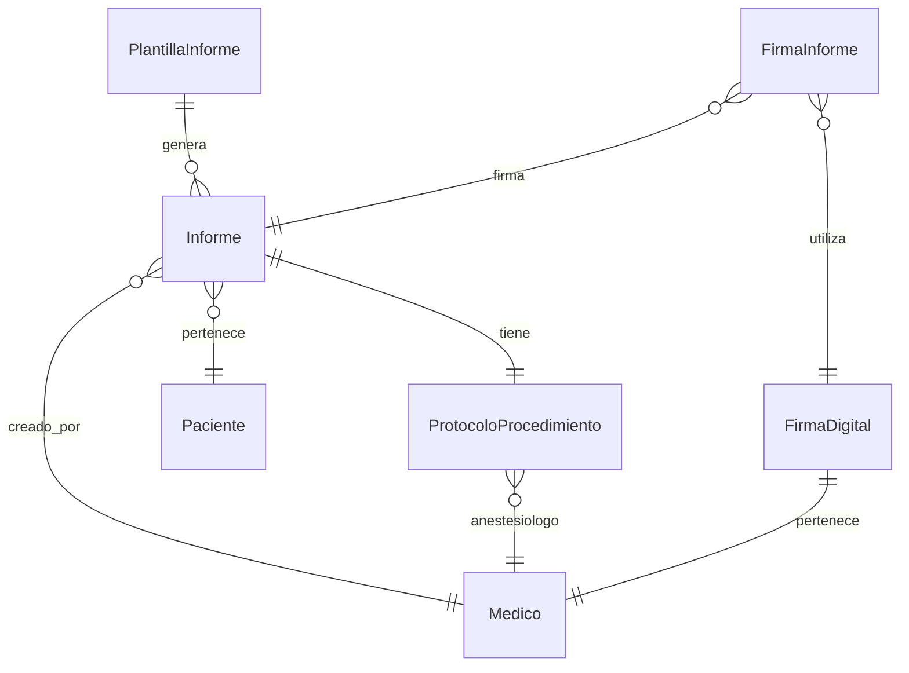

# App Informes

## Descripción
Gestiona la creación, edición y seguimiento de informes médicos, protocolos quirúrgicos y documentación clínica.

## Modelos

### PlantillaInforme
- **Campos principales:**
  - `nombre`: Nombre de la plantilla
  - `tipo`: Tipo de informe (CONSULTA, PROTOCOLO_PRE, PROTOCOLO_POST, etc.)
  - `contenido`: Texto con variables dinámicas
  - `variables`: JSONField con variables disponibles
  - `activa`: Estado de la plantilla
  - `creado_por`: ForeignKey → Medico

### Informe
- **Campos principales:**
  - `plantilla`: ForeignKey → PlantillaInforme
  - `paciente`: ForeignKey → Paciente
  - `medico`: ForeignKey → Medico
  - `estado`: Estado del informe (BORRADOR, PENDIENTE_FIRMA, FIRMADO, ANULADO)
  - `contenido`: Contenido final del informe
  - `variables_utilizadas`: Variables específicas usadas
  - `archivo_generado`: PDF generado

### ProtocoloProcedimiento
- **Campos principales:**
  - `informe`: OneToOne → Informe
  - `tipo_guia`: Tipo de guía imagenológica
  - `anestesiologo`: ForeignKey → Medico
  - `tecnica_utilizada`: Descripción técnica
  - `materiales_utilizados`: Materiales empleados
  - `medicamentos_utilizados`: Medicamentos empleados
  - `estado_paciente`: Estado post-procedimiento
  - `imagenes_adjuntas`: Archivos de imágenes

### FirmaDigital
- **Campos principales:**
  - `medico`: OneToOne → Medico
  - `firma_imagen`: Imagen de la firma
  - `certificado_digital`: Certificado de firma
  - `pin`: PIN encriptado
  - `activa`: Estado de la firma

## Diagrama de Relaciones


## Validadores
```python
def validar_pin(self, pin_ingresado):
    if self.intentos_fallidos >= 3:
        self.bloqueada = True
        self.save()
        raise ValidationError("Firma bloqueada por múltiples intentos fallidos")
    
    if not check_password(pin_ingresado, self.pin):
        self.intentos_fallidos += 1
        self.save()
        raise ValidationError("PIN incorrecto")
```

## Métodos Importantes
```python
class GeneradorPDF:
    def generar(self):
        """Genera el PDF final combinando todos los elementos"""
        context = self.get_context()
        html_content = render_to_string(self.template_path, context)
        header, footer = self.get_header_footer()
        
        # Combina todo en un HTML final
        html_final = f"""
        <!DOCTYPE html>
        <html>
            <head><meta charset="UTF-8"></head>
            <body>
                {header}
                {html_content}
                {footer}
            </body>
        </html>
        """
        
        return HTML(string=html_final).write_pdf(
            stylesheets=self.get_css(),
            presentational_hints=True
        )
```

## Vistas Principales
- `editar_informe/`: Edición de informes
- `ver_informe/`: Visualización de informes
- `firmar_informe/`: Proceso de firma
- `verificar_firma/`: Verificación de firmas

## Permisos
1. **Crear informes:**
   - Médicos autorizados
   - Administrativos con permiso especial

2. **Firmar informes:**
   - Médicos con firma digital activa
   - Roles específicos según tipo de informe

3. **Verificar firmas:**
   - Personal autorizado
   - Sistema automático

## Signals
- Generar PDF al firmar informe
- Notificar al médico cuando hay informes pendientes
- Registrar versiones al modificar

## Tests
```python
class InformeTests(TestCase):
    def setUp(self):
        self.plantilla = PlantillaInforme.objects.create(
            nombre="Test",
            tipo="CONSULTA"
        )
        self.informe = Informe.objects.create(
            plantilla=self.plantilla,
            estado="BORRADOR"
        )

    def test_firma_informe(self):
        self.informe.estado = "FIRMADO"
        self.informe.save()
        self.assertTrue(self.informe.archivo_generado)
```

## Consideraciones de Seguridad
1. **Firmas Digitales:**
   - Encriptación de PIN
   - Bloqueo por intentos fallidos
   - Registro de IP y dispositivo

2. **Versiones:**
   - Control de cambios
   - Hash de contenido
   - Auditoría de modificaciones

## Plantillas Predefinidas
```python
PLANTILLAS_PREDEFINIDAS = {
    'BLOQUEO_FINO': {
        'html': 'bloqueo_fino.html',
        'css': 'bloqueo_fino.css',
        'variables': {
            'tipo_guia': 'TAC',
            'tipo_anestesia': 'neuroleptoanalgesia',
        }
    },
    'TERMOLESION': {
        'html': 'termolesion.html',
        'css': 'termolesion.css',
        'variables': {
            'parametros_rf': {
                'temperatura': '80°C',
                'tiempo': '90 segundos'
            }
        }
    }
}
```

## Integración con Otras Apps
- Pacientes (datos del paciente)
- Operaciones (protocolos quirúrgicos)
- Consultas (informes de consulta)
- Usuarios (firmas digitales)

## Mantenimiento
- Limpieza de archivos temporales
- Compresión de PDFs antiguos
- Backup de firmas digitales
- Verificación de integridad 