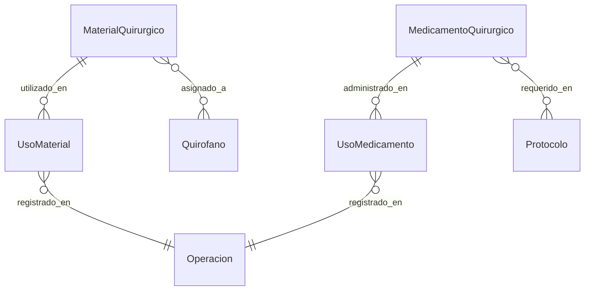

# App Insumos Médicos

## Descripción
Gestiona el inventario y control de insumos médicos y quirúrgicos, incluyendo medicamentos, materiales, y su uso en procedimientos.

## Modelos

### MaterialQuirurgico
- **Campos principales:**
  - `nombre`: Nombre del material
  - `codigo`: Código único
  - `tipo`: Tipo de material
  - `descripcion`: Descripción detallada
  - `stock`: Cantidad disponible
  - `stock_minimo`: Nivel mínimo de stock
  - `unidad_medida`: Unidad de medida
  - `precio_unitario`: Precio por unidad
  - `activo`: Estado del material

### MedicamentoQuirurgico
- **Campos principales:**
  - `nombre`: Nombre del medicamento
  - `principio_activo`: Componente principal
  - `concentracion`: Concentración del medicamento
  - `presentacion`: Forma farmacéutica
  - `stock`: Cantidad disponible
  - `lote`: Número de lote
  - `fecha_vencimiento`: Fecha de caducidad
  - `activo`: Estado del medicamento

### UsoMaterial
- **Campos principales:**
  - `operacion`: ForeignKey → Operacion
  - `material`: ForeignKey → MaterialQuirurgico
  - `cantidad`: Cantidad utilizada
  - `fecha_uso`: Fecha de utilización
  - `lote`: Número de lote usado
  - `observaciones`: Notas adicionales

### UsoMedicamento
- **Campos principales:**
  - `operacion`: ForeignKey → Operacion
  - `medicamento`: ForeignKey → MedicamentoQuirurgico
  - `dosis`: Dosis administrada
  - `via_administracion`: Vía de administración
  - `fecha_administracion`: Fecha y hora
  - `lote`: Número de lote usado

## Diagrama de Relaciones


## Validadores
```python
def validar_stock_disponible(material, cantidad):
    """Valida que haya stock suficiente"""
    if material.stock < cantidad:
        raise ValidationError(
            f"Stock insuficiente. Disponible: {material.stock}"
        )

def validar_fecha_vencimiento(value):
    """Valida que la fecha de vencimiento sea futura"""
    if value <= date.today():
        raise ValidationError(
            "La fecha de vencimiento debe ser posterior a hoy"
        )
```

## Métodos del Modelo
```python
def actualizar_stock(self, cantidad, tipo_movimiento):
    """Actualiza el stock del material/medicamento"""
    if tipo_movimiento == 'INGRESO':
        self.stock += cantidad
    elif tipo_movimiento == 'EGRESO':
        if self.stock >= cantidad:
            self.stock -= cantidad
        else:
            raise ValidationError("Stock insuficiente")
    self.save()

def verificar_stock_minimo(self):
    """Verifica si se alcanzó el stock mínimo"""
    if self.stock <= self.stock_minimo:
        self.notificar_stock_minimo()
        return True
    return False
```

## Vistas Principales
- `inventario/`: Vista general de inventario
- `movimientos/`: Registro de movimientos
- `uso_quirofano/`: Uso en quirófano
- `reportes/`: Informes y estadísticas

## Permisos
1. **Gestión de inventario:**
   - Encargados de farmacia
   - Supervisores de insumos

2. **Registro de uso:**
   - Enfermeros quirúrgicos
   - Instrumentadores

3. **Reportes:**
   - Administradores
   - Jefes de área

## Signals
- Notificar stock mínimo
- Registrar movimientos
- Actualizar costos operativos

## Tests
```python
class MaterialQuirurgicoTests(TestCase):
    def setUp(self):
        self.material = MaterialQuirurgico.objects.create(
            nombre="Aguja espinal",
            stock=100,
            stock_minimo=20
        )

    def test_uso_material(self):
        cantidad_uso = 5
        self.material.actualizar_stock(cantidad_uso, 'EGRESO')
        self.assertEqual(self.material.stock, 95)
```

## Consideraciones de Seguridad
1. **Control de acceso:**
   - Registro de movimientos
   - Trazabilidad de uso
   - Auditoría de cambios

2. **Validaciones:**
   - Control de lotes
   - Fechas de vencimiento
   - Stock mínimo

## Reportes
1. **Inventario:**
   - Stock actual
   - Movimientos mensuales
   - Próximos vencimientos

2. **Consumo:**
   - Uso por procedimiento
   - Costos por operación
   - Estadísticas de uso

## Integración con Otras Apps
- Operaciones (uso en cirugías)
- Protocolos (requerimientos)
- Quirófanos (stock asignado)
- Compras (reposición)

## Mantenimiento
- Control de vencimientos
- Actualización de precios
- Limpieza de registros
- Backup de inventario

## Flujos de Trabajo

### Ingreso de Material
1. Verificar documentación
2. Registrar lote y vencimiento
3. Actualizar stock
4. Generar comprobante

### Uso en Quirófano
1. Verificar disponibilidad
2. Registrar uso
3. Actualizar stock
4. Documentar en protocolo

## Configuraciones
```python
# settings.py
STOCK_MINIMO_ALERTA = 0.2  # 20% del stock total
DIAS_ANTICIPACION_VENCIMIENTO = 90
UNIDADES_MEDIDA = [
    ('UN', 'Unidad'),
    ('CAJ', 'Caja'),
    ('AMP', 'Ampolla'),
    ('FR', 'Frasco'),
]
``` 