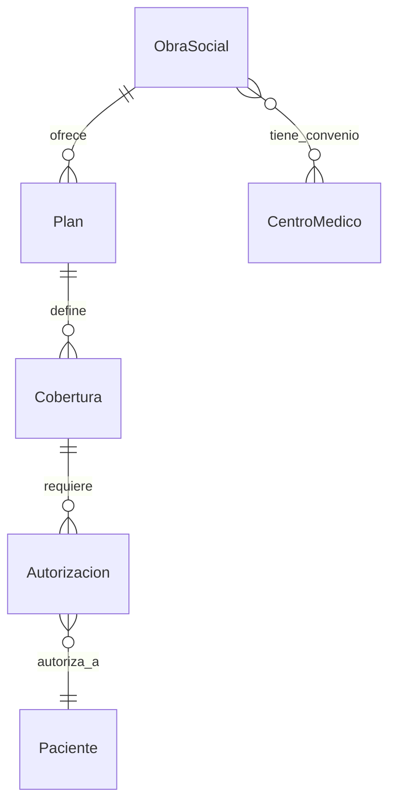

# App Obras Sociales

## Descripción
Gestiona las obras sociales, planes de cobertura, autorizaciones y facturación de prestaciones médicas.

## Modelos

### ObraSocial
- **Campos principales:**
  - `nombre`: Nombre de la obra social
  - `codigo`: Código identificador
  - `direccion`: Dirección física
  - `telefono`: Número de contacto
  - `email`: Correo electrónico
  - `sitio_web`: Sitio web oficial
  - `activa`: Estado actual

### Plan
- **Campos principales:**
  - `obra_social`: ForeignKey → ObraSocial
  - `nombre`: Nombre del plan
  - `codigo`: Código del plan
  - `descripcion`: Descripción detallada
  - `activo`: Estado del plan
  - `requiere_autorizacion`: Booleano

### Cobertura
- **Campos principales:**
  - `plan`: ForeignKey → Plan
  - `practica`: Código de práctica
  - `descripcion`: Descripción de la práctica
  - `porcentaje`: Porcentaje de cobertura
  - `copago`: Monto de copago
  - `requiere_autorizacion`: Booleano
  - `dias_validez`: Validez de autorización

### Autorizacion
- **Campos principales:**
  - `paciente`: ForeignKey → Paciente
  - `cobertura`: ForeignKey → Cobertura
  - `numero`: Número de autorización
  - `fecha_solicitud`: Fecha de solicitud
  - `fecha_autorizacion`: Fecha de autorización
  - `fecha_vencimiento`: Fecha de vencimiento
  - `estado`: Estado actual
  - `observaciones`: Notas adicionales

## Diagrama de Relaciones


## Estados y Transiciones
```python
ESTADOS_AUTORIZACION = [
    ('PENDIENTE', 'Pendiente'),
    ('EN_PROCESO', 'En Proceso'),
    ('AUTORIZADA', 'Autorizada'),
    ('RECHAZADA', 'Rechazada'),
    ('VENCIDA', 'Vencida'),
    ('UTILIZADA', 'Utilizada'),
]

def puede_transicionar(self, nuevo_estado):
    transiciones_validas = {
        'PENDIENTE': ['EN_PROCESO', 'AUTORIZADA', 'RECHAZADA'],
        'EN_PROCESO': ['AUTORIZADA', 'RECHAZADA'],
        'AUTORIZADA': ['UTILIZADA', 'VENCIDA'],
        'RECHAZADA': ['PENDIENTE'],
        'VENCIDA': [],
        'UTILIZADA': []
    }
    return nuevo_estado in transiciones_validas[self.estado]
```

## Validadores
```python
def validar_fecha_vencimiento(value):
    """Valida que la fecha de vencimiento sea futura"""
    if value <= date.today():
        raise ValidationError(
            "La fecha de vencimiento debe ser posterior a hoy"
        )

def validar_numero_autorizacion(value):
    """Valida el formato del número de autorización"""
    patron = r'^\d{4}-\d{8}-\d{2}$'
    if not re.match(patron, value):
        raise ValidationError(
            "Formato inválido. Debe ser: NNNN-NNNNNNNN-NN"
        )
```

## Métodos del Modelo
```python
def verificar_cobertura(self, practica):
    """Verifica la cobertura para una práctica"""
    try:
        cobertura = self.coberturas.get(practica=practica)
        return {
            'tiene_cobertura': True,
            'porcentaje': cobertura.porcentaje,
            'copago': cobertura.copago,
            'requiere_autorizacion': cobertura.requiere_autorizacion
        }
    except Cobertura.DoesNotExist:
        return {'tiene_cobertura': False}

def solicitar_autorizacion(self, paciente, practica):
    """Solicita una nueva autorización"""
    cobertura = self.verificar_cobertura(practica)
    if cobertura['tiene_cobertura']:
        return Autorizacion.objects.create(
            paciente=paciente,
            cobertura=cobertura,
            estado='PENDIENTE'
        )
    raise ValidationError("La práctica no tiene cobertura")
```

## Vistas Principales
- `obras_sociales/`: Lista de obras sociales
- `autorizaciones/`: Gestión de autorizaciones
- `coberturas/`: Consulta de coberturas
- `facturacion/`: Sistema de facturación

## Permisos
1. **Gestión de obras sociales:**
   - Administradores
   - Personal de facturación

2. **Autorizaciones:**
   - Administrativos
   - Médicos autorizados

3. **Facturación:**
   - Personal de facturación
   - Supervisores

## Signals
- Notificar vencimiento de autorizaciones
- Actualizar estado de autorizaciones
- Registrar cambios en coberturas

## Tests
```python
class AutorizacionTests(TestCase):
    def setUp(self):
        self.obra_social = ObraSocial.objects.create(
            nombre="OS Test",
            codigo="OST"
        )
        self.plan = Plan.objects.create(
            obra_social=self.obra_social,
            nombre="Plan Test"
        )

    def test_solicitud_autorizacion(self):
        autorizacion = self.plan.solicitar_autorizacion(
            paciente=self.paciente,
            practica="12.01.01"
        )
        self.assertEqual(autorizacion.estado, 'PENDIENTE')
```

## Consideraciones de Seguridad
1. **Datos sensibles:**
   - Encriptación de datos
   - Control de acceso
   - Registro de auditoría

2. **Validaciones:**
   - Verificación de vigencia
   - Control de duplicados
   - Integridad de datos

## Reportes
1. **Administrativos:**
   - Autorizaciones pendientes
   - Prácticas más solicitadas
   - Estadísticas de aprobación

2. **Facturación:**
   - Prestaciones por obra social
   - Montos facturados
   - Pagos pendientes

## Integración con Otras Apps
- Pacientes (afiliaciones)
- Turnos (verificación)
- Operaciones (autorizaciones)
- Facturación (liquidación)

## Mantenimiento
- Actualización de nomencladores
- Control de vencimientos
- Backup de autorizaciones
- Limpieza de registros 