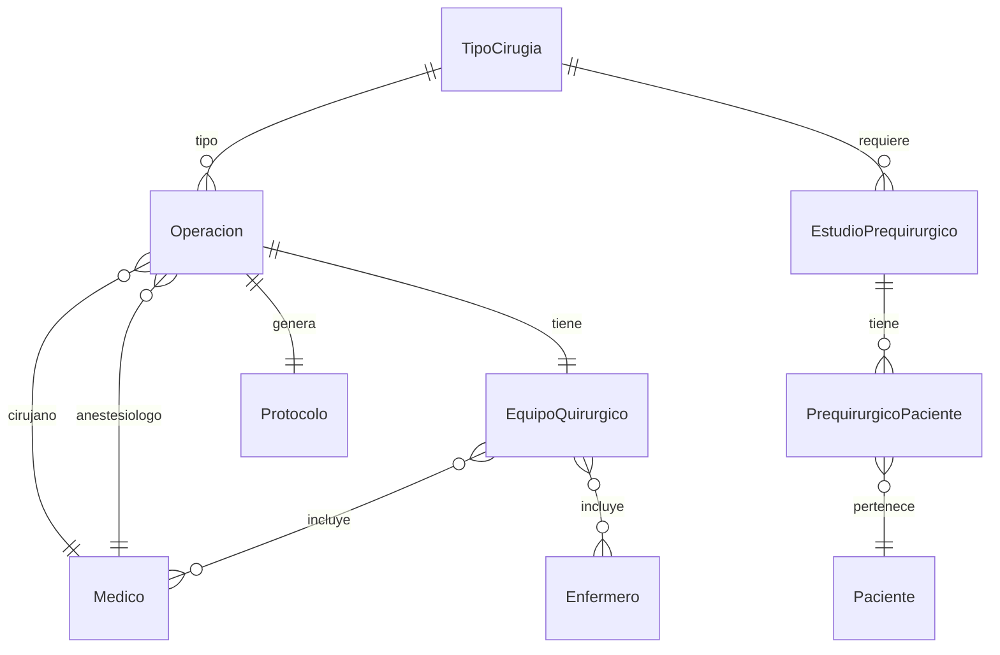

# App Operaciones

## Descripción
Gestiona todo el proceso quirúrgico, desde la programación hasta el seguimiento post-operatorio, incluyendo equipos quirúrgicos, protocolos y estudios prequirúrgicos.

## Modelos

### EstudioPrequirurgico
- **Campos principales:**
  - `nombre`: Nombre del estudio
  - `descripcion`: Descripción detallada
  - `tipo`: Tipo de estudio
  - `tipo_cirugia`: ForeignKey → TipoCirugia
  - `es_obligatorio`: Indica si es obligatorio

### PrequirurgicoPaciente
- **Campos principales:**
  - `paciente`: ForeignKey → Paciente
  - `estudio`: ForeignKey → EstudioPrequirurgico
  - `estado`: Estado del estudio (PENDIENTE, SOLICITADO, REALIZADO, VENCIDO, CANCELADO)
  - `fecha_solicitud`: Fecha de solicitud
  - `fecha_realizacion`: Fecha de realización
  - `resultado`: Resultado del estudio
  - `archivo`: Archivo adjunto del estudio

### TipoCirugia
- **Campos principales:**
  - `nombre`: Nombre del procedimiento
  - `codigo`: Código único
  - `descripcion`: Descripción detallada
  - `duracion_estimada`: Tiempo estimado
  - `complejidad`: Nivel de complejidad
  - `requiere_internacion`: Booleano

### Operacion
- **Campos principales:**
  - `paciente`: ForeignKey → Paciente
  - `tipo_cirugia`: ForeignKey → TipoCirugia
  - `fecha_operacion`: Fecha programada
  - `estado`: Estado actual
  - `quirofano`: ForeignKey → Quirofano
  - `cirujano_principal`: ForeignKey → Medico
  - `anestesiologo`: ForeignKey → Medico
  - `instrumentador`: ForeignKey → Medico
  - `equipo_quirurgico`: OneToOne → EquipoQuirurgico

### EquipoQuirurgico
- **Campos principales:**
  - `operacion`: OneToOne → Operacion
  - `cirujanos_asistentes`: ManyToMany → Medico
  - `enfermeros`: ManyToMany → Enfermero
  - `instrumentadores`: ManyToMany → Medico

### Protocolo
- **Campos principales:**
  - `operacion`: OneToOne → Operacion
  - `medico_responsable`: ForeignKey → Medico
  - `diagnostico_pre`: Diagnóstico preoperatorio
  - `diagnostico_post`: Diagnóstico postoperatorio
  - `descripcion_procedimiento`: Descripción detallada
  - `complicaciones`: Complicaciones registradas
  - `estado`: Estado del protocolo

## Diagrama de Relaciones


## Estados y Transiciones
```python
ESTADOS_ESTUDIO = [
    ('PENDIENTE', 'Pendiente'),
    ('SOLICITADO', 'Solicitado'),
    ('REALIZADO', 'Realizado'),
    ('VENCIDO', 'Vencido'),
    ('CANCELADO', 'Cancelado'),
]

def puede_transicionar_estudio(self, nuevo_estado):
    transiciones_validas = {
        'PENDIENTE': ['SOLICITADO', 'CANCELADO'],
        'SOLICITADO': ['REALIZADO', 'VENCIDO', 'CANCELADO'],
        'REALIZADO': ['VENCIDO'],
        'VENCIDO': ['PENDIENTE'],
        'CANCELADO': ['PENDIENTE']
    }
    return nuevo_estado in transiciones_validas[self.estado]
```

## Validadores
```python
def validar_estudios_completos(operacion):
    """Valida que todos los estudios requeridos estén realizados"""
    estudios_requeridos = EstudioPrequirurgico.objects.filter(
        tipo_cirugia=operacion.tipo_cirugia,
        es_obligatorio=True
    )
    
    for estudio in estudios_requeridos:
        estudio_paciente = PrequirurgicoPaciente.objects.filter(
            paciente=operacion.paciente,
            estudio=estudio,
            estado='REALIZADO'
        ).exists()
        
        if not estudio_paciente:
            raise ValidationError(
                f"Falta el estudio obligatorio: {estudio.nombre}"
            )
```

## Métodos del Modelo
```python
def solicitar_estudio(self):
    """Solicita un estudio prequirúrgico"""
    if self.estado == 'PENDIENTE':
        self.estado = 'SOLICITADO'
        self.fecha_solicitud = timezone.now()
        self.save()
        self.notificar_solicitud()
        return True
    return False

def registrar_resultado(self, resultado, archivo=None):
    """Registra el resultado de un estudio"""
    if self.estado == 'SOLICITADO':
        self.estado = 'REALIZADO'
        self.resultado = resultado
        self.archivo = archivo
        self.fecha_realizacion = timezone.now()
        self.save()
        self.notificar_resultado()
        return True
    return False
```

## Vistas Principales
- `programar_operacion/`: Programación de cirugías
- `confirmar_operacion/`: Confirmación de equipo y recursos
- `protocolo_operatorio/`: Registro del protocolo
- `calendario_quirurgico/`: Vista de calendario

## Permisos
1. **Programar operaciones:**
   - Médicos cirujanos
   - Administrativos autorizados

2. **Confirmar operaciones:**
   - Jefe de quirófano
   - Cirujano principal

3. **Registrar protocolo:**
   - Cirujano principal
   - Médicos autorizados

## Signals
- Notificar al equipo al confirmar operación
- Actualizar disponibilidad de quirófano
- Registrar cambios en el protocolo

## Tests
```python
class OperacionTests(TestCase):
    def setUp(self):
        self.tipo_cirugia = TipoCirugia.objects.create(
            nombre="Apendicectomía",
            duracion_estimada=timedelta(hours=2)
        )
        self.operacion = Operacion.objects.create(
            tipo_cirugia=self.tipo_cirugia,
            estado="PROGRAMADA"
        )

    def test_confirmacion(self):
        self.operacion.confirmar_operacion()
        self.assertEqual(self.operacion.estado, "CONFIRMADA")
```

## Consideraciones de Seguridad
1. **Validaciones:**
   - Disponibilidad de quirófano
   - Completitud del equipo
   - Autorizaciones necesarias

2. **Auditoría:**
   - Registro de cambios de estado
   - Control de acceso por rol
   - Trazabilidad de modificaciones

## Reportes
1. **Operativos:**
   - Ocupación de quirófanos
   - Estadísticas por tipo de cirugía
   - Rendimiento de equipos

2. **Clínicos:**
   - Tasas de éxito
   - Complicaciones frecuentes
   - Tiempos quirúrgicos

## Integración con Otras Apps
- Pacientes (datos del paciente)
- Insumos (materiales y medicamentos)
- Informes (protocolos quirúrgicos)
- Turnos (programación)

## Mantenimiento
- Actualización de catálogos
- Verificación de disponibilidad
- Control de recursos
- Backup de protocolos 