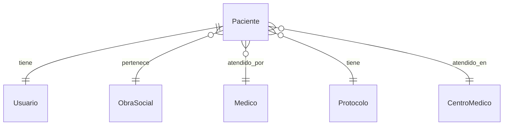

# App Pacientes

## Descripción
Gestiona la información de pacientes, incluyendo datos personales, historial médico, dashboard personalizado y relaciones con otras entidades del sistema.

## Modelos

### Paciente
- **Información Personal:**
  - `nombre`: Nombre del paciente
  - `apellido`: Apellido del paciente
  - `dni`: Documento de identidad (único)
  - `fecha_nacimiento`: Fecha de nacimiento
  - `sexo`: Género del paciente
  - `direccion`: Dirección física
  - `telefono`: Número de contacto
  - `email`: Correo electrónico

- **Información Médica:**
  - `obra_social`: ForeignKey → ObraSocial
  - `numero_afiliacion`: Número de afiliado
  - `antecedentes_medicos`: Historial médico
  - `alergias`: Registro de alergias
  - `medicacion_actual`: Medicamentos en uso
  - `grupo_sanguineo`: Tipo de sangre

- **Relaciones:**
  - `usuario`: OneToOne → Usuario
  - `medico`: ForeignKey → Medico
  - `protocolo`: ForeignKey → Protocolo
  - `derivado`: ForeignKey → Medico (médico que deriva)

## Diagrama de Relaciones


## Validadores
```python
def validar_dni(value):
    if not value.isdigit():
        raise ValidationError("El DNI debe contener solo números.")

def validar_telefono(value):
    if not value.replace('+', '').replace('-', '').isdigit():
        raise ValidationError("Formato de teléfono inválido.")
```

## Métodos del Modelo
```python
def calcular_edad(self):
    today = date.today()
    return today.year - self.fecha_nacimiento.year - (
        (today.month, today.day) < 
        (self.fecha_nacimiento.month, self.fecha_nacimiento.day)
    )

def fecha_nacimiento_formateada(self):
    return self.fecha_nacimiento.strftime("%d-%m-%Y")
```

## Índices de Base de Datos
```python
class Meta:
    indexes = [
        models.Index(fields=['dni']),
        models.Index(fields=['apellido']),
        models.Index(fields=['fecha_hora_ingreso']),
    ]
```

## Vistas Principales
- Lista de pacientes
- Detalle de paciente
- Crear/Editar paciente
- Historia clínica
- Dashboard de paciente

## Formularios
- `PacienteForm`: Datos básicos
- `HistorialMedicoForm`: Antecedentes y condiciones
- `ContactoEmergenciaForm`: Información de contacto

## Permisos
1. **Ver paciente:**
   - Médicos asignados
   - Administrativos autorizados
   - El propio paciente

2. **Editar paciente:**
   - Médicos asignados
   - Administrativos autorizados

3. **Ver historia clínica:**
   - Médicos asignados
   - El propio paciente

## Signals
- Crear usuario al crear paciente
- Notificar al médico asignado
- Actualizar historial de cambios

## Tests
```python
class PacienteTests(TestCase):
    def setUp(self):
        self.paciente = Paciente.objects.create(
            nombre="Juan",
            apellido="Pérez",
            dni="12345678"
        )

    def test_calcular_edad(self):
        self.paciente.fecha_nacimiento = date(1990, 1, 1)
        edad_esperada = date.today().year - 1990
        self.assertEqual(self.paciente.calcular_edad(), edad_esperada)
```

## Endpoints API
```python
urlpatterns = [
    path('api/pacientes/', PacienteListView.as_view()),
    path('api/pacientes/<int:pk>/', PacienteDetailView.as_view()),
    path('api/pacientes/<int:pk>/historia-clinica/', 
         HistoriaClinicaView.as_view()),
]
```

## Flujos de Trabajo

### Ingreso de Nuevo Paciente
1. Verificar DNI existente
2. Crear registro básico
3. Asignar obra social
4. Vincular con médico
5. Generar historia clínica

### Actualización de Historia Clínica
1. Verificar permisos
2. Registrar cambios
3. Notificar involucrados
4. Actualizar índices

## Consideraciones de Seguridad
1. **Datos Sensibles:**
   - Encriptación de información médica
   - Acceso restringido por rol
   - Registro de auditoría

2. **Consentimientos:**
   - Manejo de datos personales
   - Compartir información médica
   - Procedimientos específicos

## Reportes
1. **Listados:**
   - Pacientes por médico
   - Pacientes por obra social
   - Pacientes por procedimiento

2. **Estadísticas:**
   - Distribución por edad
   - Distribución por obra social
   - Procedimientos más comunes

## Mantenimiento
- Limpieza de registros temporales
- Actualización de índices
- Verificación de integridad de datos

## Integración con Otras Apps
- Turnos
- Operaciones
- Informes
- Notificaciones

## Vistas Implementadas

### Dashboard del Paciente
```python
@login_required
def dashboard_paciente(request, pk):
    """
    Dashboard personalizado mostrando:
    - Información general del paciente
    - Estudios prequirúrgicos pendientes
    - Próximas operaciones programadas
    - Últimas consultas
    - Estadísticas generales
    """
```

### Gestión de Pacientes
- `crear_paciente`: Creación de nuevo paciente
- `listar_pacientes`: Lista de todos los pacientes
- `editar_paciente`: Edición de datos del paciente
- `cargar_excel`: Importación masiva de pacientes

## Templates Implementados

### Dashboard (dashboard.html)
- **Información del Paciente:**
  - Avatar con iniciales
  - Datos personales básicos
  - Obra social

- **Estadísticas Rápidas:**
  - Total de consultas
  - Estudios pendientes
  - Operaciones realizadas

- **Secciones Principales:**
  - Estudios prequirúrgicos pendientes
  - Próximas operaciones
  - Últimas consultas

### Gestión
- `crear_paciente.html`: Formulario de creación
- `listar_pacientes.html`: Lista de pacientes
- `editar_paciente.html`: Formulario de edición
- `cargar_excel.html`: Importación de datos

## Formularios
- `PacienteForm`: Datos básicos del paciente
- `ArchivoExcelForm`: Importación de datos

## Características Implementadas

### Dashboard Personalizado
1. **Visualización de Datos:**
   - Resumen de información personal
   - Estadísticas de atención médica
   - Timeline de actividades

2. **Seguimiento:**
   - Estudios pendientes
   - Próximas operaciones
   - Historial de consultas

3. **Diseño:**
   - Interfaz moderna y responsiva
   - Iconografía intuitiva
   - Tarjetas informativas

### Importación de Datos
- Carga masiva desde Excel
- Validación de datos
- Manejo de errores

## Integración con Otras Apps
- **Operaciones:**
  - Estudios prequirúrgicos
  - Programación de cirugías

- **Consultas:**
  - Historial de consultas
  - Diagnósticos

- **Obras Sociales:**
  - Cobertura
  - Autorizaciones

## Próximos Pasos
1. Implementar filtros en el dashboard
2. Agregar gráficos estadísticos
3. Mejorar la visualización de historias clínicas
4. Implementar sistema de notificaciones

## Consideraciones de Seguridad
- Acceso restringido por roles
- Validación de permisos
- Protección de datos sensibles

## Mantenimiento
- Limpieza de registros temporales
- Actualización de índices
- Backup de historias clínicas 