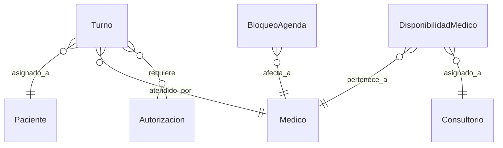

# App Turnos

## Descripción
Gestiona el sistema de turnos para consultas médicas y procedimientos, incluyendo agendamiento, recordatorios y gestión de disponibilidad.

## Modelos

### Turno
- **Campos principales:**
  - `paciente`: ForeignKey → Paciente
  - `medico`: ForeignKey → Medico
  - `fecha_hora`: Fecha y hora del turno
  - `tipo`: Tipo de turno (CONSULTA, PROCEDIMIENTO)
  - `duracion`: Duración en minutos
  - `estado`: Estado actual
  - `motivo`: Motivo de la consulta
  - `observaciones`: Notas adicionales
  - `recordatorio_enviado`: Booleano
  - `confirmado`: Estado de confirmación

### DisponibilidadMedico
- **Campos principales:**
  - `medico`: ForeignKey → Medico
  - `dia_semana`: Día de la semana
  - `hora_inicio`: Hora de inicio
  - `hora_fin`: Hora de fin
  - `consultorio`: ForeignKey → Consultorio
  - `activa`: Estado de la disponibilidad
  - `excepciones`: JSONField para fechas especiales

### BloqueoAgenda
- **Campos principales:**
  - `medico`: ForeignKey → Medico
  - `fecha_inicio`: Inicio del bloqueo
  - `fecha_fin`: Fin del bloqueo
  - `motivo`: Razón del bloqueo
  - `tipo`: Tipo de bloqueo (VACACIONES, CONGRESO, PERSONAL)

## Diagrama de Relaciones


## Estados y Transiciones
```python
ESTADOS_TURNO = [
    ('PENDIENTE', 'Pendiente'),
    ('CONFIRMADO', 'Confirmado'),
    ('EN_ESPERA', 'En Sala de Espera'),
    ('EN_CONSULTA', 'En Consulta'),
    ('FINALIZADO', 'Finalizado'),
    ('CANCELADO', 'Cancelado'),
    ('AUSENTE', 'Paciente Ausente'),
]

def puede_transicionar(self, nuevo_estado):
    transiciones_validas = {
        'PENDIENTE': ['CONFIRMADO', 'CANCELADO'],
        'CONFIRMADO': ['EN_ESPERA', 'CANCELADO', 'AUSENTE'],
        'EN_ESPERA': ['EN_CONSULTA', 'AUSENTE'],
        'EN_CONSULTA': ['FINALIZADO'],
        'FINALIZADO': [],
        'CANCELADO': [],
        'AUSENTE': []
    }
    return nuevo_estado in transiciones_validas[self.estado]
```

## Validadores
```python
def validar_disponibilidad(medico, fecha_hora, duracion):
    """Valida disponibilidad del médico"""
    hora_fin = fecha_hora + timedelta(minutes=duracion)
    
    # Verificar horario de atención
    disponibilidad = DisponibilidadMedico.objects.filter(
        medico=medico,
        dia_semana=fecha_hora.weekday(),
        hora_inicio__lte=fecha_hora.time(),
        hora_fin__gte=hora_fin.time()
    )
    if not disponibilidad.exists():
        raise ValidationError("Fuera del horario de atención")
    
    # Verificar turnos existentes
    if Turno.objects.filter(
        medico=medico,
        fecha_hora__lt=hora_fin,
        fecha_hora__gt=fecha_hora,
        estado__in=['PENDIENTE', 'CONFIRMADO', 'EN_ESPERA']
    ).exists():
        raise ValidationError("Horario no disponible")

def validar_anticipacion(fecha_hora):
    """Valida que el turno se solicite con anticipación mínima"""
    minima_anticipacion = timedelta(hours=24)
    if fecha_hora - timezone.now() < minima_anticipacion:
        raise ValidationError(
            "Los turnos deben solicitarse con 24hs de anticipación"
        )
```

## Métodos del Modelo
```python
def confirmar_turno(self):
    """Confirma un turno pendiente"""
    if self.estado == 'PENDIENTE':
        self.estado = 'CONFIRMADO'
        self.save()
        self.enviar_confirmacion()
        return True
    return False

def cancelar_turno(self, motivo):
    """Cancela un turno programado"""
    estados_cancelables = ['PENDIENTE', 'CONFIRMADO']
    if self.estado in estados_cancelables:
        self.estado = 'CANCELADO'
        self.observaciones = f"Cancelado: {motivo}"
        self.save()
        self.notificar_cancelacion()
        return True
    return False
```

## Vistas Principales
- `agenda_medico/`: Agenda del médico
- `solicitar_turno/`: Solicitud de turnos
- `sala_espera/`: Gestión de sala de espera
- `disponibilidad/`: Configuración de disponibilidad

## Permisos
1. **Gestión de turnos:**
   - Administrativos
   - Médicos
   - Pacientes (portal)

2. **Configuración de agenda:**
   - Médicos
   - Supervisores

3. **Sala de espera:**
   - Recepcionistas
   - Enfermeros

## Signals
- Notificar confirmación de turno
- Recordatorios automáticos
- Actualizar estado de sala de espera

## Tests
```python
class TurnoTests(TestCase):
    def setUp(self):
        self.medico = Medico.objects.create(
            nombre="Dr. Test"
        )
        self.turno = Turno.objects.create(
            medico=self.medico,
            fecha_hora=timezone.now() + timedelta(days=1)
        )

    def test_confirmacion(self):
        self.turno.confirmar_turno()
        self.assertEqual(self.turno.estado, 'CONFIRMADO')
```

## Consideraciones de Seguridad
1. **Validaciones:**
   - Control de horarios
   - Verificación de permisos
   - Autorizaciones requeridas

2. **Notificaciones:**
   - Confirmación segura
   - Datos sensibles protegidos
   - Registro de cambios

## Reportes
1. **Operativos:**
   - Ocupación de agenda
   - Tasa de ausentismo
   - Tiempos de espera

2. **Estadísticos:**
   - Turnos por especialidad
   - Distribución horaria
   - Cancelaciones

## Integración con Otras Apps
- Pacientes (datos personales)
- Consultas (registro)
- Obras Sociales (autorizaciones)
- Notificaciones (recordatorios)

## Mantenimiento
- Limpieza de turnos antiguos
- Actualización de disponibilidad
- Backup de agendas
- Control de duplicados

## Configuraciones
```python
# settings.py
ANTICIPACION_MINIMA = 24  # horas
DURACION_DEFAULT = 30  # minutos
INTERVALO_RECORDATORIOS = 24  # horas antes
HORARIO_ATENCION = {
    'inicio': '08:00',
    'fin': '20:00'
}
``` 