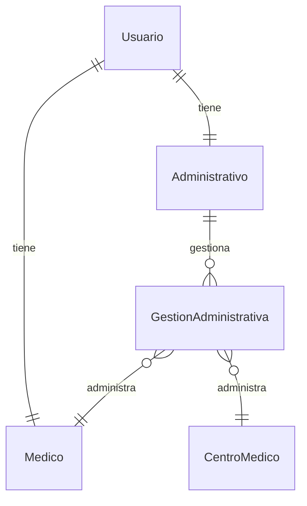

# App Usuarios

## Descripción
Gestiona la autenticación y autorización de usuarios en el sistema, incluyendo médicos, administrativos y pacientes.

## Modelos

### Usuario (Custom User Model)
- Extiende `AbstractUser` de Django
- **Campos adicionales:**
  - `rol`: Tipo de usuario (paciente, médico, administrativo)
  - `telefono`: Número de contacto
  - `direccion`: Dirección física

### Médico
- **Campos principales:**
  - `usuario`: OneToOne → Usuario
  - `tipo`: Tipo de médico (CIRUJANO, ANESTESIOLOGO, INSTRUMENTADOR)
  - `especialidad`: Especialidad médica
  - `matricula`: Número de matrícula profesional

### Administrativo
- **Campos principales:**
  - `usuario`: OneToOne → Usuario
  - `departamento`: Área de trabajo

### GestionAdministrativa
- **Campos principales:**
  - `administrativo`: ForeignKey → Administrativo
  - `tipo_gestion`: Tipo (MEDICO, CENTRO)
  - `medico`: ForeignKey → Médico (opcional)
  - `centro_medico`: ForeignKey → CentroMedico (opcional)

## Relaciones Principales


## Permisos y Grupos
1. **Médicos**
   - Acceso a historias clínicas
   - Gestión de turnos propios
   - Creación de protocolos

2. **Administrativos**
   - Gestión de turnos
   - Gestión de obras sociales
   - Reportes básicos

## Vistas Principales
- `login/`: Inicio de sesión
- `logout/`: Cierre de sesión
- `perfil/`: Gestión de perfil
- `cambiar-contraseña/`: Cambio de contraseña

## Formularios
- `UsuarioForm`: Registro y edición de usuarios
- `MedicoForm`: Datos específicos de médicos
- `AdministrativoForm`: Datos específicos de administrativos

## Signals
- Crear perfil automáticamente al crear usuario
- Actualizar permisos al cambiar rol

## Tests
```python
from django.test import TestCase
from .models import Usuario, Medico

class UsuarioTests(TestCase):
    def setUp(self):
        self.usuario = Usuario.objects.create_user(
            username='test',
            password='test123',
            rol='medico'
        )

    def test_crear_medico(self):
        medico = Medico.objects.create(
            usuario=self.usuario,
            tipo='CIRUJANO',
            matricula='12345'
        )
        self.assertEqual(medico.usuario.rol, 'medico')
```

## Endpoints API
```python
# urls.py
urlpatterns = [
    path('api/usuarios/', UsuarioListView.as_view()),
    path('api/medicos/', MedicoListView.as_view()),
    path('api/administrativos/', AdministrativoListView.as_view()),
]
```

## Consideraciones de Seguridad
1. Contraseñas:
   - Mínimo 8 caracteres
   - Combinación de letras, números y símbolos
   - Cambio obligatorio cada 90 días

2. Sesiones:
   - Timeout después de 30 minutos
   - Una sesión activa por usuario

3. Permisos:
   - Basados en roles
   - Granulares por modelo
   - Auditoría de acciones

## Flujos de Trabajo Típicos

### Registro de Médico
1. Crear usuario base
2. Asignar rol 'medico'
3. Crear perfil de médico
4. Asignar permisos básicos
5. Vincular con centro médico

### Gestión Administrativa
1. Asignar administrativo a médico/centro
2. Configurar alcance de gestión
3. Establecer período de vigencia

## Mantenimiento
- Limpieza periódica de sesiones
- Actualización de permisos
- Respaldo de datos de usuarios

## Dependencias
- Django Auth System
- Django Guardian (permisos por objeto)
- Django REST Framework (API)

## Configuración
```python
# settings.py
AUTH_USER_MODEL = 'usuarios.Usuario'
LOGIN_REDIRECT_URL = 'dashboard'
LOGOUT_REDIRECT_URL = 'home'
``` 