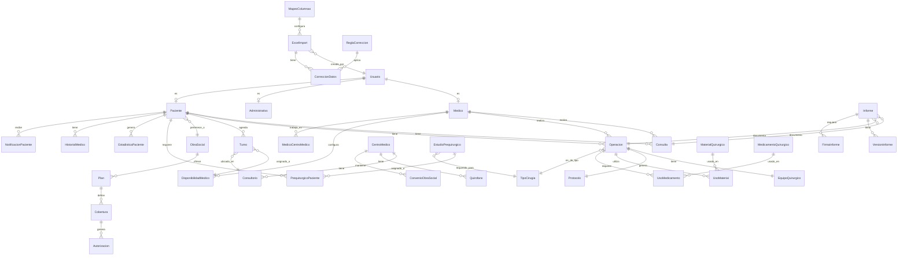

# Diagrama General de la Base de Datos

## Descripción
Este diagrama muestra las relaciones principales entre las diferentes apps del sistema, incluyendo el módulo de importación de datos y el dashboard de pacientes.

## Diagrama de Relaciones

## Notas sobre el Diagrama

### Módulos Principales
1. **Usuarios y Roles**
   - Usuario como base para Médicos, Administrativos y Pacientes
   - Gestión de permisos y accesos

2. **Gestión de Pacientes**
   - Dashboard personalizado
   - Historias clínicas
   - Consultas y operaciones
   - Turnos y seguimiento
   - Estudios prequirúrgicos

3. **Dashboard de Paciente**
   - Estadísticas personalizadas
   - Historial médico
   - Notificaciones
   - Seguimiento de estudios

4. **Operaciones y Protocolos**
   - Equipos quirúrgicos
   - Materiales y medicamentos
   - Documentación y seguimiento
   - Estudios prequirúrgicos requeridos

5. **Importación de Datos**
   - Importación desde Excel
   - Validación y corrección
   - Mapeo de columnas
   - Reglas de transformación

6. **Centros Médicos**
   - Consultorios y quirófanos
   - Convenios con obras sociales
   - Disponibilidad de recursos

7. **Documentación**
   - Informes médicos
   - Versiones y firmas digitales
   - Protocolos y plantillas

### Relaciones Clave
1. **Paciente-Dashboard**
   - Estadísticas personalizadas
   - Historial médico
   - Notificaciones

2. **Paciente-Estudios**
   - Estudios prequirúrgicos
   - Estado de los estudios
   - Seguimiento de resultados

3. **Operación-Estudios**
   - Requisitos por tipo de cirugía
   - Validación de estudios completos
   - Control de vencimientos 