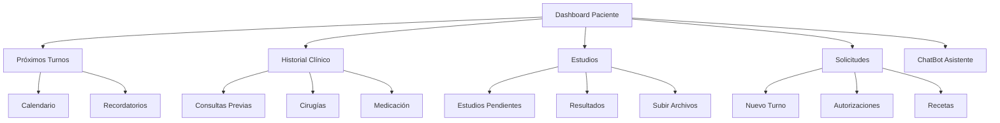
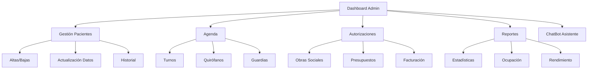
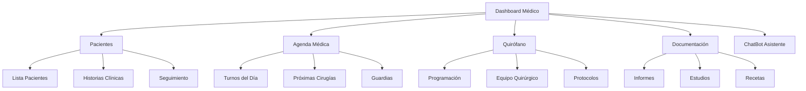

# Dashboards por Tipo de Usuario

## 1. Dashboard Paciente

### Componentes Principales

### Funcionalidades Específicas

#### 1. Gestión de Turnos
- Vista de calendario con próximos turnos
- Sistema de recordatorios (email/SMS)
- Solicitud de nuevos turnos
- Cancelación/reprogramación
- Historial de asistencias

#### 2. Historial Clínico
- Resumen de consultas previas
- Registro de cirugías
- Medicación actual
- Alergias y condiciones crónicas
- Estudios realizados

#### 3. Estudios Prequirúrgicos
- Lista de estudios requeridos
- Estado de cada estudio
- Sistema de carga de resultados
- Visualizador de documentos
- Notificaciones de vencimiento

#### 4. Comunicación
- Chat directo con administrativos
- Mensajes del médico tratante
- Notificaciones importantes
- Recordatorios automáticos

## 2. Dashboard Administrativo

### Componentes Principales

### Funcionalidades Específicas

#### 1. Gestión de Pacientes
- Alta de nuevos pacientes
- Actualización de datos
- Gestión de obras sociales
- Historial de atención
- Seguimiento de pagos

#### 2. Agenda y Turnos
- Vista múltiple de calendarios
- Gestión de quirófanos
- Programación de guardias
- Control de disponibilidad
- Gestión de urgencias

#### 3. Autorizaciones y Pagos
- Trámites con obras sociales
- Generación de presupuestos
- Control de facturación
- Seguimiento de cobros
- Reportes financieros

#### 4. Herramientas de Productividad
- Lista de tareas pendientes
- Recordatorios automáticos
- Plantillas de documentos
- Workflow automatizado
- Métricas de rendimiento

## 3. Dashboard Médico

### Componentes Principales

### Funcionalidades Específicas

#### 1. Gestión de Pacientes
- Lista de pacientes activos
- Acceso a historias clínicas
- Evolución y seguimiento
- Estudios y resultados
- Medicación actual

#### 2. Agenda Profesional
- Calendario de consultas
- Programación quirúrgica
- Guardias y disponibilidad
- Notificaciones importantes
- Recordatorios de seguimiento

#### 3. Quirófano y Cirugías
- Programación quirúrgica
- Gestión de equipo
- Protocolos quirúrgicos
- Requisitos prequirúrgicos
- Seguimiento postoperatorio

#### 4. Documentación Clínica
- Generación de informes
- Prescripción de medicamentos
- Solicitud de estudios
- Certificados médicos
- Protocolos quirúrgicos

## Características Comunes

### 1. Interfaz
- Diseño responsivo
- Tema claro/oscuro
- Accesos rápidos personalizables
- Notificaciones en tiempo real
- Búsqueda global

### 2. ChatBot Asistente
- Ayuda contextual
- Tutoriales interactivos
- Respuestas rápidas
- Base de conocimiento
- Aprendizaje continuo

### 3. Seguridad
- Autenticación de dos factores
- Registro de actividad
- Permisos granulares
- Encriptación de datos
- Backups automáticos

### 4. Integración
- Sistema de mensajería
- Notificaciones push
- Calendario sincronizado
- Exportación de datos
- APIs externas

## Tecnologías Recomendadas

### Frontend
- Vue.js con Composition API
- TailwindCSS para UI
- VueX para estado
- PWA para offline
- Socket.io para tiempo real

### Backend
- Django REST Framework
- Django Channels
- Celery para tareas
- Redis para caché
- PostgreSQL

### Seguridad
- JWT para autenticación
- HTTPS obligatorio
- Rate limiting
- Validación de datos
- Auditoría de accesos

## Plan de Implementación

### Fase 1: Core
1. Autenticación y perfiles
2. Dashboards básicos
3. Gestión de turnos
4. ChatBot básico

### Fase 2: Funcionalidades
1. Gestión documental
2. Integración completa
3. Reportes avanzados
4. Automatizaciones

### Fase 3: Optimización
1. Analytics avanzados
2. ML para predicciones
3. Optimización de procesos
4. Escalabilidad 