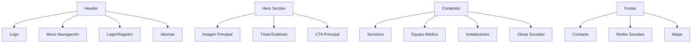
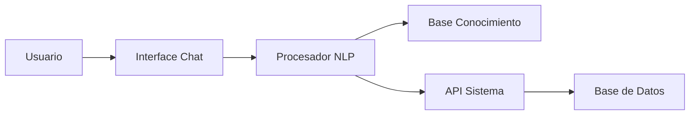
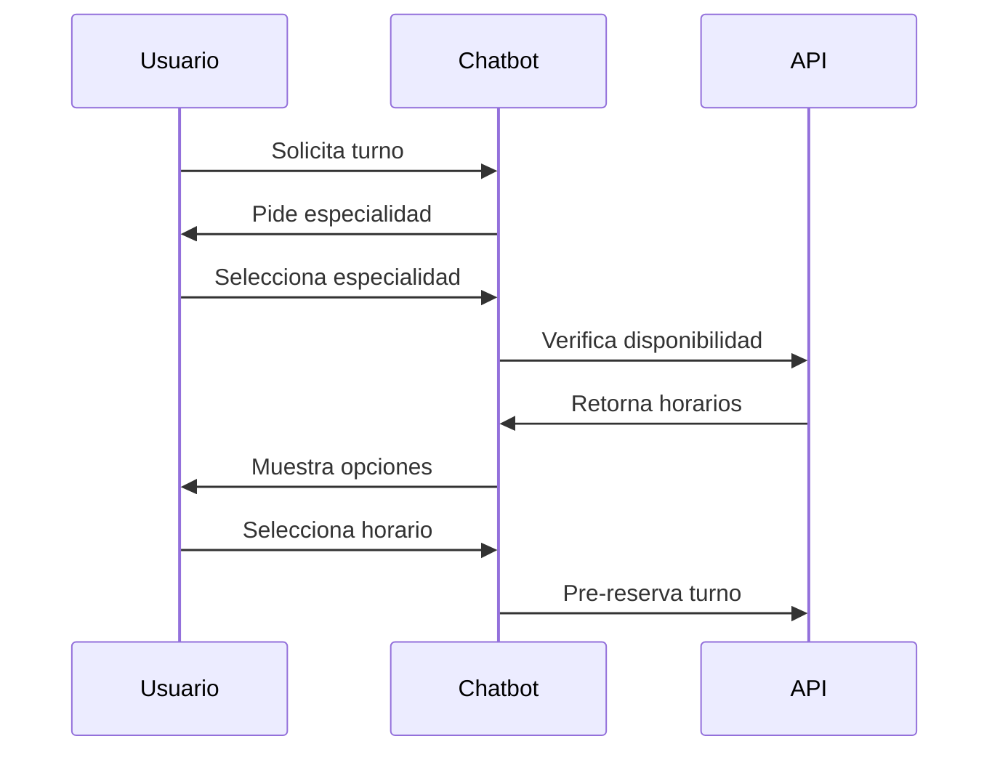

# Página Principal y Chatbot

## Descripción General
La página principal sirve como punto de entrada para visitantes no autenticados, presentando información institucional y facilitando el primer contacto a través de un chatbot inteligente.

## Estructura de la Página Principal

### 1. Componentes Principales


### 2. Diseño Responsivo
- Mobile First
- Breakpoints:
  - Mobile: < 768px
  - Tablet: 768px - 1024px
  - Desktop: > 1024px

### 3. Secciones Detalladas

#### Header
```html
<header class="main-header">
    <div class="logo-container">
        
    </div>
    <nav class="main-nav">
        <ul>
            <li><a href="#servicios">Servicios</a></li>
            <li><a href="#equipo">Equipo Médico</a></li>
            <li><a href="#instalaciones">Instalaciones</a></li>
            <li><a href="#obras-sociales">Obras Sociales</a></li>
        </ul>
    </nav>
    <div class="auth-buttons">
        <button class="login">Iniciar Sesión</button>
        <button class="register">Registrarse</button>
    </div>
</header>
```

#### Servicios Médicos
```html
<section class="services">
    <div class="service-card" v-for="service in services">
        
        <h3>{{ service.name }}</h3>
        <p>{{ service.description }}</p>
        <button @click="showServiceDetails(service)">
            Ver más
        </button>
    </div>
</section>
```

## Chatbot Inteligente

### 1. Arquitectura


### 2. Funcionalidades

#### Básicas
```python
class ChatbotBasic:
    def __init__(self):
        self.knowledge_base = KnowledgeBase()
        self.nlp_processor = NLPProcessor()
    
    def process_query(self, query: str) -> str:
        intent = self.nlp_processor.get_intent(query)
        return self.generate_response(intent)
```

#### Avanzadas
```python
class ChatbotAdvanced(ChatbotBasic):
    def check_appointment_availability(self, date: str) -> bool:
        return self.api.check_availability(date)
    
    def estimate_cost(self, service: str) -> float:
        return self.api.get_service_cost(service)
```

### 3. Integración con Backend

#### API Endpoints
```python
urlpatterns = [
    path('api/chatbot/query/', ChatbotQueryView.as_view()),
    path('api/chatbot/appointment/', ChatbotAppointmentView.as_view()),
    path('api/chatbot/costs/', ChatbotCostView.as_view()),
]
```

### 4. Flujos de Conversación

#### Consulta de Turno


## Consideraciones de Implementación

### 1. SEO
- Meta tags optimizados
- Schema.org markup
- Sitemap XML
- URLs amigables

### 2. Performance
- Lazy loading de imágenes
- Minificación de assets
- Caching de respuestas del chatbot
- CDN para recursos estáticos

### 3. Accesibilidad
- WCAG 2.1 compliance
- Navegación por teclado
- Soporte para lectores de pantalla
- Alto contraste

### 4. Seguridad
- Rate limiting en chatbot
- Validación de inputs
- Protección contra XSS
- CSRF tokens

## Tecnologías Recomendadas

### Frontend
- Vue.js/React para componentes
- TailwindCSS para estilos
- Socket.io para chat en tiempo real
- PWA capabilities

### Backend
- Django Channels para WebSocket
- Redis para caché
- Celery para tareas asíncronas
- PostgreSQL para datos

### NLP/Chatbot
- NLTK/spaCy para procesamiento
- TensorFlow para ML
- FastAPI para microservicio
- MongoDB para logs

## Métricas y Analytics

### KPIs
1. Engagement
   - Tiempo en página
   - Tasa de rebote
   - Páginas por sesión

2. Chatbot
   - Tasa de resolución
   - Tiempo de respuesta
   - Satisfacción usuario

3. Conversión
   - Turnos agendados
   - Consultas realizadas
   - Registros completados

## Plan de Implementación

### Fase 1: MVP
1. Landing page básica
2. Chatbot con funciones básicas
3. Integración con sistema de turnos

### Fase 2: Mejoras
1. Personalización por usuario
2. ML para recomendaciones
3. Integración con CRM

### Fase 3: Optimización
1. A/B testing
2. Optimización de conversión
3. Expansión de funcionalidades 